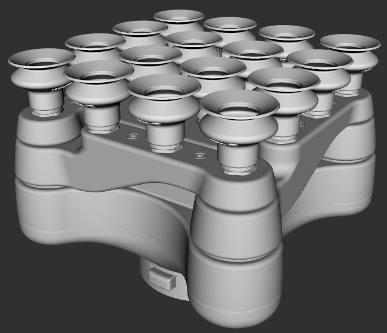

# OnRobot vacuum gripper

This package contains the URDF files describing OnRobot vacuum grippers (VG10 and VGC10).

```
roslaunch onrobot_vg_description disp_vg10_model.launch  
roslaunch onrobot_vg_description disp_vgc10_1cup_model.launch  
roslaunch onrobot_vg_description disp_vgc10_4cups_model.launch  
```

## Visual and Collision models
### VG10
    

### VGC10 (1 suction cup)
    

### VGC10 (4 suction cups)
    

## Reference
- To generate a collision model, you can use [rosmodelgen](https://github.com/takuya-ki/rosmodelgen)
